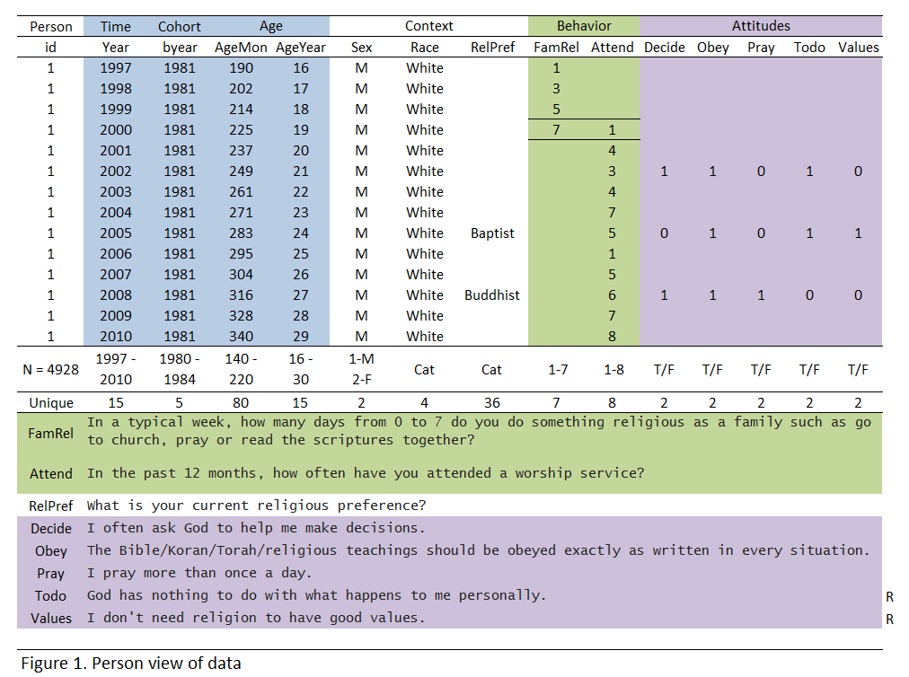

Describing the structure of the Data in NLSY97_Religion_10242012
========================================================
## Mock data to illustrate variables, scales and possible values

Documenting the import of data from NLSY Web-Investigator
========================================================

## Databanks
databanks have a form of *SOURCE_IDENTIFIER_DATE*
in this case *NLSY-97_Religion_24102012*
This tagset was saved from the NLSY Web-Investigator having variables ordered according to the *QName and Year*

# The folder "databank" 
in "NLYS97_Religiosity_24102012" repository contains 
1.zipfile downloaded from the NLSY Web-Investigator
2.folder containing the unziped download. The files in the folder are standard options provided by the NLSY  investigator download menu.
3.Sas code calling in the data from the .dat file.
4.An Excel template that helps recode the names of the variables.

### Official Documentation
Most of these links are from the primary developer, and are focused on a specific part of our workflow. 
https://github.com/OuhscCcanMiechvEvaluation/MReporting/blob/master/DocumentationGlobal/ResourcesOfficial.md

### Opinions
Theis collection of articles, blogs, and unofficial documentation should help provide context for what we're trying to do with our workflow. 
https://github.com/OuhscCcanMiechvEvaluation/MReporting/blob/master/DocumentationGlobal/ResourcesOpinions.md

### Security Issues
As David says, no matter how cool and efficient our reporting system is, it won't matter if it introduces a security hole.  Make sure that this public GitHub repository does NOT contain any PHI dataset, or a password/token to the MySQL or REDCap server.  As we design and run reports, let's continue to add items to this checklist:
https://github.com/OuhscCcanMiechvEvaluation/MReporting/blob/master/DocumentationGlobal/ResourcesOpinions.md

### Project Health & History
The repository's website describes the progress from a few perspectives.  The [issue tracker](https://github.com/OuhscCcanMiechvEvaluation/MReporting/issues?state=open) manages the tasks assigned to different collaborators, and lists the associated milestones.  Also, the project's [wiki](https://github.com/OuhscCcanMiechvEvaluation/MReporting/wiki/Home-page-of-MReporting-wiki) links to a list of reports, and to the REDCap change log.
